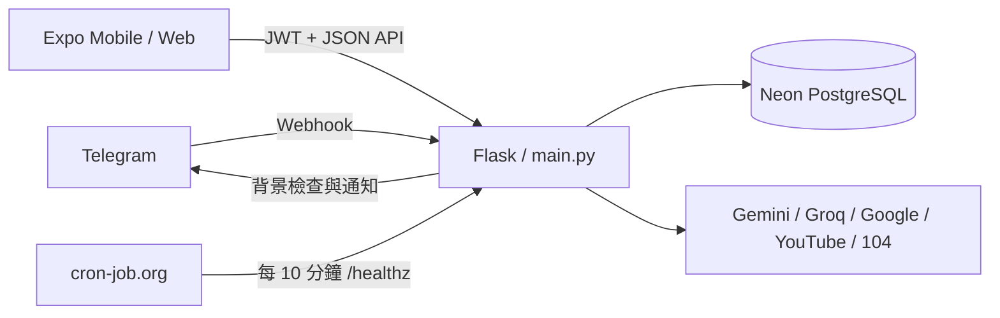

# Robinson — Robin 與家人們的生活小助手

Robinson 是一套家庭生活助理，包含 Telegram Bot、Expo／React Native Mobile App 與 Flask API。Telegram 負責完整資料管理、跨日期補登、自然語言與媒體輸入；Mobile App 提供今日生活紀錄、視覺化分析及部分生活資料管理。

本專案目前部署於 Render（後端）與 Vercel（Expo Web），資料存放於 Neon PostgreSQL。正式產品規格以 [`docs/specs/SPEC.md`](docs/specs/SPEC.md) 為準。

## 主要功能

### Telegram Bot

- 通關密碼綁定、Owner 權限管理與個人隱私遮罩
- 飲食、運動、體態、心情、記帳等日常紀錄及歷史補登
- 待辦事項、重要日子、收藏、旅遊行程、成果展示與目標追蹤
- 圖片辨識、Telegram 語音及上傳音檔轉錄確認
- 固定功能名稱與別名導引、10 分鐘功能模式逾時及 30 分鐘草稿保護
- Owner 專屬技術分享、求職、考試、功能開關、排程及系統錯誤管理
- Telegram／Mobile App 事故追蹤與可選收件人的康復通知

除 `/start` 外，不提供舊 Slash Command；正式資料異動一律走權限化選單、摘要及二次確認。

### Mobile App

- 帳密登入、Refresh Token 輪替、個人資訊及偏好設定
- 今日體態、飲食、運動、心情與記帳紀錄
- 待辦、重要日子、收藏、旅遊、探索地圖與成果展示
- 共用目標摘要、日期區間卡片、最近紀錄及圖表分析
- 體態／飲食／運動、記帳、求職、考試與技術分享分析頁
- Mobile 未預期 5xx 安全回覆及 Owner 事故通報

Mobile 的生活紀錄只允許異動今天資料；跨日期新增、編輯與完整設定由 Telegram 處理。實際權限與欄位規則請查閱 [`docs/reference/mobile-app-ux.md`](docs/reference/mobile-app-ux.md) 與 [`docs/reference/api_schema.md`](docs/reference/api_schema.md)。

## 系統架構



後端維持目前的 `main.py`／`src/` 結構；已取消的 Phase 6 目錄遷移不再執行。

## 技術棧

| 範圍 | 技術 |
| --- | --- |
| Backend | Python 3.11、Flask |
| Database | PostgreSQL（Neon）、psycopg2 |
| Mobile | Expo 57、React Native 0.86、React 19、TypeScript 6 |
| AI／媒體 | Google Gemini、Groq Whisper、Pillow、pydub／ffmpeg |
| 外部服務 | Telegram、Google Drive／Calendar、Gmail（IMAP 讀信）、SendGrid（寄信 API）、YouTube、104、Nominatim |
| 測試／品質 | pytest、pytest-cov、Ruff、TypeScript |
| 部署 | Docker、Render、Vercel、cron-job.org |

## 目錄結構

```text
.
├── main.py                 # Flask 入口、啟動 migration、健康檢查與背景工作
├── src/
│   ├── api/                # Mobile App HTTP API
│   ├── bot/                # Telegram webhook、選單與功能流程
│   ├── services/           # 共用商業邏輯
│   └── migrations/         # PostgreSQL 向前 migration
├── mobile/
│   ├── app/                # Expo Router 頁面
│   └── src/                # Mobile 元件、服務與共用程式
├── submodules/             # DB、Telegram、Google、LLM 等外部服務封裝
├── tests/                  # 後端單元與整合測試
└── docs/                   # 規格、進度、ADR、Reference 與文件模板
```

## 本機開發

### 1. 後端環境

需求：Python 3.11、PostgreSQL 連線、ffmpeg。

```bash
python3.11 -m venv .venv
source .venv/bin/activate
pip install -r requirements-dev.txt
cp .env.example .env
```

依需求填入 `.env`，不要提交真實值。最小啟動核心包含：

| 變數 | 用途 |
| --- | --- |
| `DATABASE_URL` | PostgreSQL DSN |
| `TELEGRAM_BOT_TOKEN` | Telegram Bot Token |
| `ROBIN_TELEGRAM_TOKEN` | Owner Telegram Chat ID |
| `APP_JWT_SECRET` | Mobile JWT 簽章密鑰，至少 32 字元 |
| `APP_CORS_ORIGINS` | 允許的 Mobile Web Origin，逗號分隔 |

依啟用功能另外設定：

- Gemini：`GEMINI_API_BOT_KEY`、`GEMINI_API_IMAGE_KEY1`、`GEMINI_API_IMAGE_KEY2`、`GEMINI_API_TEXT_KEY`、`GEMINI_API_PRIVACY_KEY`、`GEMINI_API_SKILL_GROWTH_KEY`、`GEMINI_API_JOB_SEARCH_KEY`
- 語音：`VOICE_API_KEY`
- Google Drive：`GDRIVE_OAUTH_CLIENT_ID`、`GDRIVE_OAUTH_CLIENT_SECRET`、`GDRIVE_OAUTH_REFRESH_TOKEN`、`GDRIVE_FOLDER_ID`
- Google Calendar：`GOOGLE_CALENDAR_OAUTH_CLIENT_ID`、`GOOGLE_CALENDAR_OAUTH_CLIENT_SECRET`、`GOOGLE_CALENDAR_OAUTH_REFRESH_TOKEN`、`GOOGLE_CALENDAR_ID`
- Gmail（IMAP 讀信）／SendGrid（寄信 API，2026-08-24 起取代直連 SMTP，因 Render 免費方案封鎖對外 SMTP 埠）／YouTube／定位：`GMAIL_USER`、`GMAIL_PASSWORD`、`SENDGRID_API_KEY`、`YOUTUBE_API_KEY`、`NOMINATIM_USER_AGENT`
- 選填調校：`APP_BCRYPT_ROUNDS`、`PORT`

完整名稱與假值範例見 [`.env.example`](.env.example)。

### 2. 啟動後端

```bash
python main.py
```

預設監聽 `http://localhost:8080`：

- `GET /`：服務存活文字
- `GET /healthz`：健康檢查，並以背景執行緒觸發排程檢查
- `POST /telegram/webhook`：Telegram Update 入口
- `/api/app/*`：Mobile App API

若設定了 `DATABASE_URL`，啟動時會自動套用尚未執行的 migration。

### 3. 啟動 Mobile App

需求：Node.js 與 pnpm。

```bash
cd mobile
pnpm install
cp .env.example .env
pnpm run dev
```

`mobile/.env` 的 `EXPO_PUBLIC_API_BASE_URL` 指向本機後端，例如 `http://localhost:8080`。也可使用：

```bash
pnpm run ios
pnpm run android
pnpm run web
```

## 測試與品質檢查

後端完整回歸：

```bash
pytest -q
ruff check .
```

需要覆蓋率時：

```bash
pytest --cov
```

Mobile 型別與 Web 建置：

```bash
cd mobile
pnpm run typecheck
pnpm run build:web
```

提交前另執行：

```bash
git diff --check
```

## Database Migration

Migration 位於 `src/migrations/`，命名格式為 `NNNN_description.sql`，由 `schema_migrations` 記錄已套用檔案。

1. 先盤點 Schema、資料轉換、索引／鎖表風險與回滾方式。
2. 將 SQL 提交 Robin 審核；破壞性變更需二次確認。
3. 核准後新增下一個編號的 migration，禁止修改已套用檔案。
4. 同步 Service／測試與 [`docs/reference/db_schema.md`](docs/reference/db_schema.md)。
5. Render 啟動時依序自動套用；實際結果以正式資料庫 `schema_migrations` 為準。

完整流程見 [`src/migrations/README.md`](src/migrations/README.md)。

## 部署

- Backend：GitHub `main` push 觸發 Render Docker 部署；容器以 `python main.py` 啟動。
- Mobile Web：Vercel 建置 Expo Web 靜態輸出，`/api/*` 代理至後端。
- Keep-alive／排程：cron-job.org 每 10 分鐘呼叫 `/healthz`；端點立即回覆，工作在背景執行緒進行。
- Telegram：正式 Webhook 指向後端的 `/telegram/webhook`。

README 不保存正式環境網址、Token 或帳密；部署技術現況以規格與 Reference 為準。

## 文件索引

| 文件 | 用途 |
| --- | --- |
| [`docs/specs/SPEC.md`](docs/specs/SPEC.md) | 唯一現行正式產品規格 |
| [`docs/specs/PROGRESS.md`](docs/specs/PROGRESS.md) | 開發、測試、commit、push 與部署狀態 |
| [`docs/specs/DRAFT.md`](docs/specs/DRAFT.md) | 待討論、取消與擱置項目 |
| [`docs/ADR/discuss/`](docs/ADR/discuss/) | 需求與架構決策歷史 |
| [`docs/ADR/debug/`](docs/ADR/debug/) | Bug 根因、修復及驗證紀錄 |
| [`docs/reference/api_schema.md`](docs/reference/api_schema.md) | API 與 Telegram 路由現況 |
| [`docs/reference/db_schema.md`](docs/reference/db_schema.md) | PostgreSQL Schema 現況 |
| [`docs/reference/mobile-app-ux.md`](docs/reference/mobile-app-ux.md) | Mobile UX 與跨頁規則 |

## 安全注意事項

- 禁止提交 `.env`、Token、密碼、OAuth Secret、私鑰或服務帳號檔案。
- 正式錯誤回覆不得包含 Stack Trace、SQL、伺服器路徑或內部服務資訊。
- Mobile 未預期 5xx 只回傳安全文案，技術細節由 Owner 維運流程處理。
- 正式資料異動需重新驗證使用者權限；高風險操作必須摘要並二次確認。
- Commit、push 與部署是三個獨立步驟；專案規範禁止 AI 執行 `git push`。

## 尚未排入 Roadmap

- 英文口說與其他語言學習
- 非 TOEIC 證照題庫的實際導入與驗收

以上項目仍屬擱置，請勿依 DRAFT 內容直接實作。
